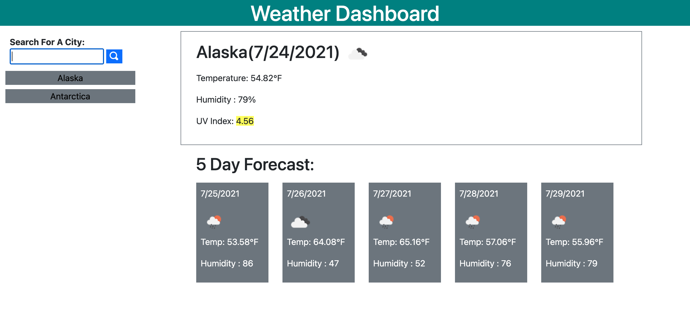
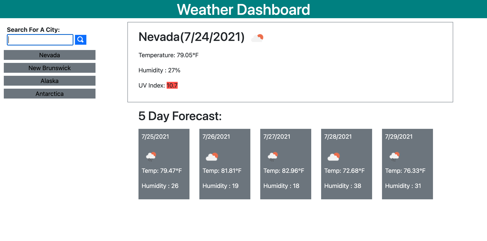

## Weather LookUp

Welcome to Weather LookUp - Weather Dashboard!

This repository contains code for Rutgers Coding Bootcamp's 6th challenge Homework:
Server-Side APIs.

For this challenge, we were tasked with making a website that people can use to to look up weather conditions for any city. The weather conditions displayed include the current day's weather conditions and the conditions for the next 5 days.

The weather conditions displayed include the following:

1. Name of City and the Date
2. Temperature
3. UV Index that includes changing colors depending on how high or low the index is (green for low, yellow for moderate, orange for high, red for very high).

Another neat feature of the website is that it stores your past 10 city searches and you can click on them instead of typing a search again to display weather conditions for that city!

## Website
You can visit the wesbite here!

https://ronnieve23.github.io/WeatherLookUp/

## Screen Shots
Below are screenshots of the website. Each screenshot has a different city that displays different UV Indexes that has different colors depending on how high or low the index is.

